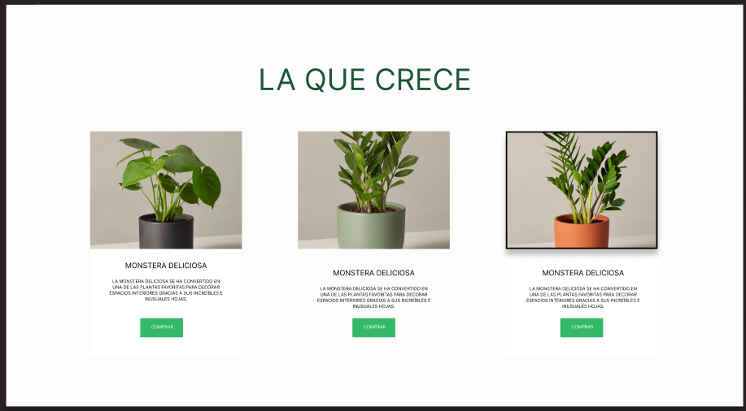
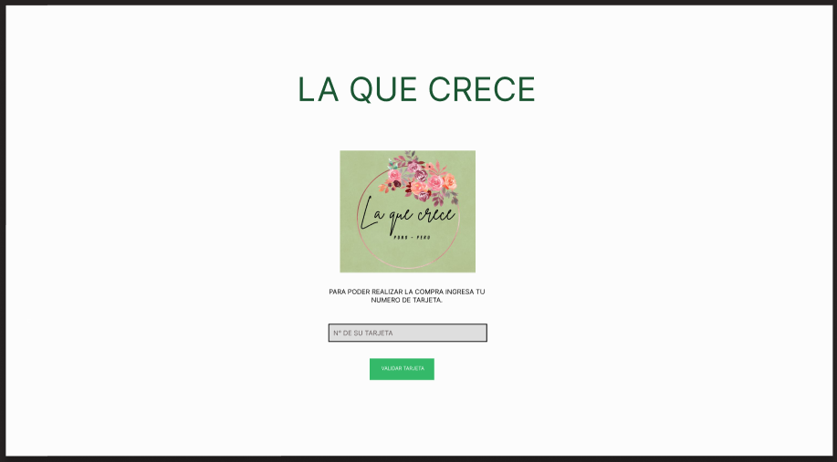

# Tarjeta de crédito válida 

El proyecto tiene por finalidad  realizar una validacion de tarjeta esto se realizo con la ayuda de el algoritmo de Luhn tambien llamado algoritmo de módulo 10, es un método de suma de verificación, se utiliza para validar números de identificación; tales como el IMEI de los celulares, tarjetas de crédito, etc.

## Índice

* [1. Usuarios](#1-usuarios)
* [2. Prototipo](#2-prototipo)

## 1. Usuarios
Los principales usuarios son para personas que les guste las plantas y busquen un espacio en el que puedan encontrar sobre caracteristicas y precios de plantas.
Los objetivos de los usuarios con relacion a este producto es que en un mismo lugar puedan curosear y busacar las plantas de su preferencia y una vez identificadas ellos pueden realizar la compra online, esta pagina busca resolver el problema de poder comprar alguna planta de la preferencia del usuario al instante.

## 2. Prototipo
* Prototipo de alta fidelidad de la primera y segunda pantalla:

* puedes ver el proyecto en este enlace: [GitHub pages](https://zka21.github.io/DEV004-card-validation/)
